<h1 align="center">
  <picture>
    <source media="(prefers-color-scheme: dark)" srcset="assets/banner-dark.svg">
    
  </picture>
</h1>

tabkeeper closes terminal tabs you haven't used in a while and lets you bring them back later.

It works like Arc's auto-archive, but for tools that run coding agents: [Orca](https://github.com/stablyai/orca), [cmux](https://github.com/manaflow-ai/cmux), and tmux.

## Why

When you run many agents at once, old tabs pile up. tabkeeper cleans them up for you. Before closing a tab, it saves:

- the tab's title and folder
- its recent output
- the agent conversation it was running (Claude Code, Codex, or opencode)

When you restore the tab, the conversation continues where it left off.

## Install

Download the binary for your system from the [latest release](https://github.com/jun-hash/tabkeeper/releases/latest):

```sh
curl -fsSL -o tabkeeper https://github.com/jun-hash/tabkeeper/releases/latest/download/tabkeeper-darwin-arm64
chmod +x tabkeeper
mv tabkeeper ~/.local/bin/
```

Replace `darwin-arm64` with `darwin-x64`, `linux-x64`, or `linux-arm64` if needed.

## Quick start

```sh
tabkeeper sweep --dry-run --verbose   # see what would be closed, without closing anything
tabkeeper sweep                       # close idle tabs
tabkeeper list                        # see what was closed
tabkeeper restore <id>                # bring one back
tabkeeper schedule install            # run every 15 minutes
```

Start with `--dry-run`. The first run can close many old tabs at once.

## How it decides

tabkeeper looks at two levels:

- **Tabs.** A tab idle for 12 hours is closed.
- **Workspaces** (an Orca worktree, a cmux workspace, a tmux session). If every tab in it has been idle for 7 days, the whole workspace is closed.

It never closes:

- pinned workspaces
- tabs where an agent is working
- the tab or workspace you are looking at
- a repository's main worktree (its idle tabs can still be closed)
- anything that matches your `protect` settings
- tabs whose last activity is unknown

It also leaves at least one tab open in every workspace it keeps.

> [!NOTE]
> Only agents count as "working". A dev server or `ssh` session with no recent output looks idle. Add them to `protect.titles` to keep them open.

## Restore

```sh
tabkeeper list              # archived items, newest first
tabkeeper show <id> -s      # details and saved output
tabkeeper restore <id>      # reopen it
```

You can type just the first few characters of an id.

Restore reopens each tab in the same folder, with the same title. If an agent was running, it resumes the conversation (for example with `claude --resume <id>`). If the workspace was deleted, cmux and tmux create it again.

## Commands

| Command | What it does |
| --- | --- |
| `sweep` | Close idle tabs and workspaces. Add `--dry-run` to preview, `--verbose` to see what was kept and why. |
| `list` | Show archived items. Add `--all` to include restored ones. |
| `show <id>` | Show one item. Add `--scrollback` to see its saved output. |
| `restore <id>` | Reopen an item. |
| `schedule install` | Run `sweep` every 15 minutes. Use `--every 1h` to change it. `schedule uninstall` stops it. |
| `purge` | Delete old worktrees. See below. |
| `doctor` | Check which apps tabkeeper can reach. |
| `init` | Create a config file. |

All commands accept `--json` and `--config <path>`.

## Configuration

Run `tabkeeper init` to create `~/.config/tabkeeper/config.json`:

```json
{
  "sessionIdle": "12h",
  "workspaceIdle": "7d",
  "scrollbackLines": 2000,
  "protect": {
    "paths": ["~/dev/infra"],
    "titles": ["npm run dev", "^ssh "]
  },
  "purge": { "enabled": false, "after": "30d" },
  "hosts": {
    "orca": { "enabled": true },
    "cmux": { "enabled": true }
  }
}
```

| Setting | Meaning |
| --- | --- |
| `sessionIdle` | How long a tab must be idle before it is closed. |
| `workspaceIdle` | How long a whole workspace must be idle before it is closed. |
| `scrollbackLines` | How many lines of output to save per tab. |
| `protect.paths` | Workspaces in these folders are never closed. |
| `protect.titles` | Tabs whose title matches one of these patterns are never closed (case-insensitive regex). |
| `purge` | Delete worktrees that have been archived longer than `after`. Off by default. |
| `hosts` | Turn each app on or off. Use `bin` to set a custom path to its CLI. |

Durations use `m`, `h`, `d`, or `w`, and can be combined, like `1d12h`.

Archives are plain files in `~/.local/share/tabkeeper`.

## Deleting old worktrees

This is off by default. With `purge.enabled`, tabkeeper deletes an Orca worktree after it has been archived for 30 days, but only if:

- it has no uncommitted or untracked files
- it has no stashes
- every commit is pushed

Files ignored by `.gitignore` (like `.env`) are deleted with it.

Preview first with `tabkeeper purge --dry-run`.

## Supported apps

| App | How tabkeeper closes a workspace | Can delete worktrees |
| --- | --- | --- |
| Orca | Uses Orca's own archive and sleep. Orca restores the sessions itself. | Yes |
| cmux | Closes the workspace. tabkeeper restores it. | No |
| tmux | Example plugin in [`examples/tmux-plugin.mjs`](examples/tmux-plugin.mjs) | No |

To support another app, see [Adding a host](docs/adding-a-host.md).

## Limitations

- If a restore fails halfway, running it again may open some tabs twice.
- A tab you start using right as a sweep runs can still be closed. You can restore it.
- Orca's archive feature isn't part of its public CLI. If it changes, tabkeeper falls back to closing tabs one by one.

## Development

```sh
bun install
bun test
bun run dev -- sweep --dry-run
```

See [Adding a host](docs/adding-a-host.md) for how the code is organized. Pushing a `v*` tag publishes a release with binaries.

## License

MIT
